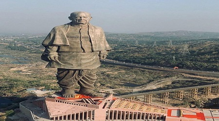
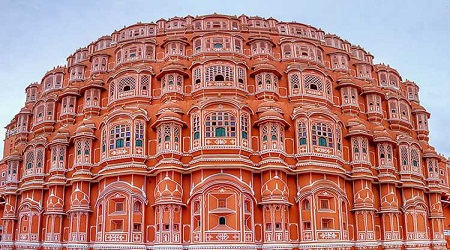
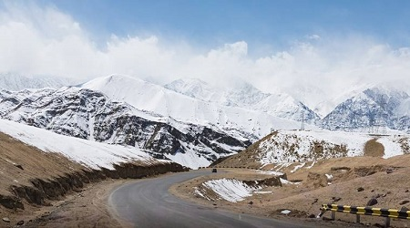
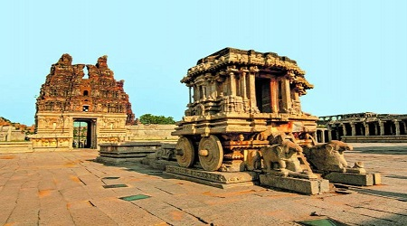

# assignment2-Kasuvojula
# Akhil Kasuvojula
## Chicken 65
Chicken 65 is a **classic poultry** dish with origins in Chennai, India. It consists of deep-fried chicken that is marinated in ginger, lemon, red chiles, and a variety of other spices. There are a few theories about the origin of chicken 65. The most popular theory says that it was created in **Tamil Nadu**.

***

# SHOPPING FOR BASIC NEEDS
1. Go to hyvee store by booking a cab
2. start finding groceries and pick
3. List of items
     1. onions
     2. carrot
     3. knife
     4. rice cooker
     5. bowl
4. Go to the billing counter
5. barcode with every product
6. pay the bill
7. book a cab
8. come back to home

*  place all the groceries in kitchen
*  Arange all the items properly
*  wash your hands.

[My Bio](https://github.com/akhilkasuvojula/assignment2-Kasuvojula/blob/main/AboutMe.md)


***

# Recommeded favourite places to vist

## 1.Statue of Unity:
The world’s tallest statue has been completed in Gujarat, India. Standing almost 600 feet tall, the Statue of Unity depicts Indian freedom fighter and politician Sardar Vallabhbhai Patel, one of the most prominent leaders of the Indian independence movement, and the first Deputy Prime Minister of India.

| LOCATION | SPENDING HOURS | Price |
| --- | ---------- | -------|
| Gujarat | 3 hours | RS.1500 |



## 2.Hawa Mahal:
Hawa Mahal is a palace in Jaipur, India approximately 300 kilometers from the capital city of Delhi. Built from red and pink sandstone, the palace sits on the edge of the City Palace, Jaipur, and extends to the Zenana, or women's chambers.

| LOCATION | SPENDING HOURS | Price |
| --- | ---------- | -------|
| Jaipur | 2 hours | RS.1000 |



## 3.Leh-Ladakh:
This mountainous region located in the Jammu and Kashmir area extends beyond the Himalaya and features breathtaking landscapes and picture-perfect Tibetan Buddhist monasteries. Also known as the “Land of High Passes”, this high-altitude destination is home to mostly Tibetans who are largely self-sufficient in food and fuel.

| LOCATION | SPENDING HOURS | Price |
| --- | ---------- | -------|
| Ladakh | 5 hours | RS.2500 |



## 4.Hampi:
 Hampi is like discovering a fantasy land in a far-off place. A landscape dotted with giant boulders, hills, and ancient ruins juxtaposed by lush palm groves, paddy fields, and banana plantations create a destination that’s popular for those looking for something offbeat. For backpackers and seasoned travelers, this is easily one of the best places to visit in India. 

| LOCATION | SPENDING HOURS | Price |
| --- | ---------- | -------|
| Karnataka | 3 hours | RS.1500 |



***

## My favourite Quotes
>"You have to dream before your dreams can come true."
*A. P. J. Abdul Kalam*

>"Learn from yesterday, live for today, hope for tomorrow. The important thing is not to stop questioning."
*Albert Einstein*

# GDScript Programming Language
>GDScript is a high-level, dynamically typed programming language used to create content. It uses a syntax similar to Python (blocks are indent-based and many keywords are similar). Its goal is to be optimized for and tightly integrated with Godot Engine, allowing great flexibility for content creation and integration.

Quick Link <https://docs.godotengine.org/en/stable/getting_started/scripting/gdscript/gdscript_basics.html>

```

class_name Item

class_name Inventory

func add(reference : Item, amount : int = 1):
	var item = find_item(reference)
	if not item:
		item = _instance_item_from_db(reference)
	item.amount += amount

```
Quick Link <https://www.gdquest.com/tutorial/godot/gdscript/typed-gdscript/>


